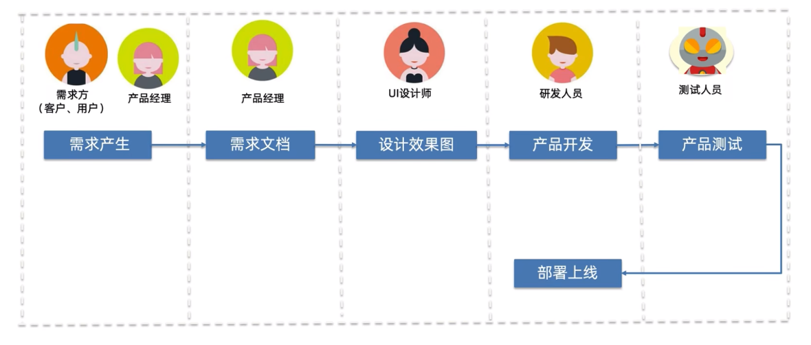
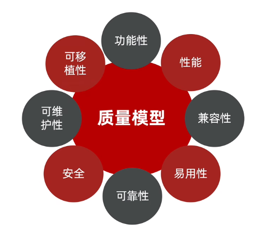
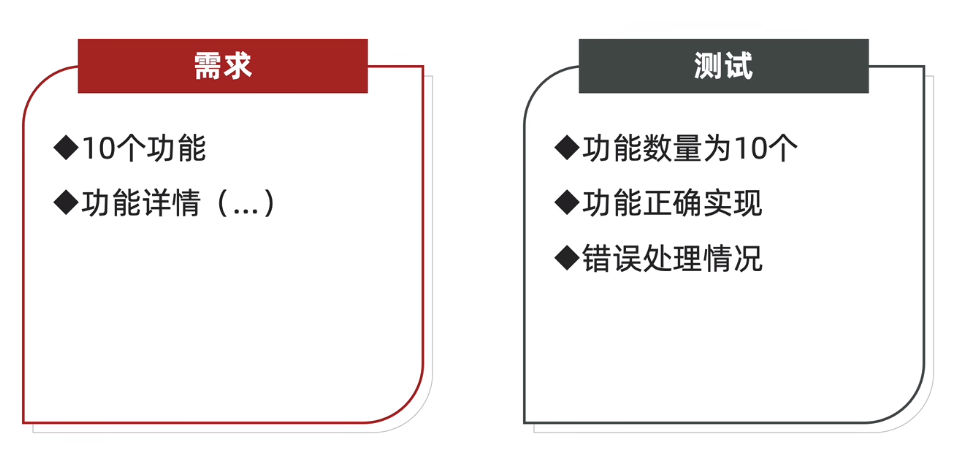
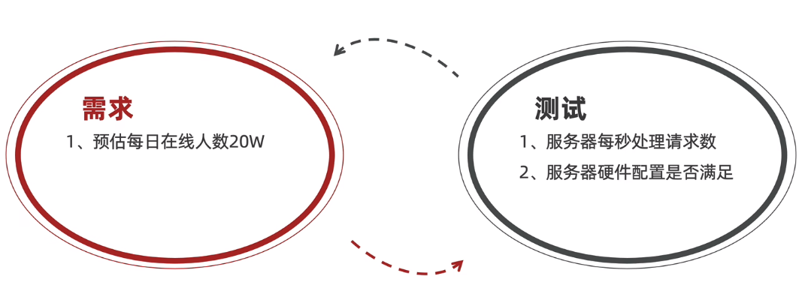
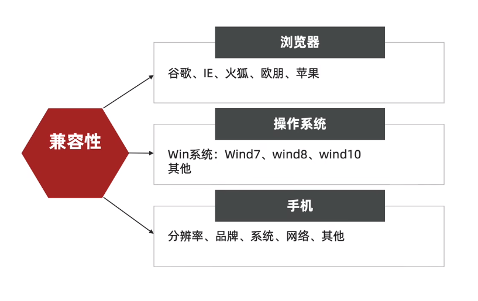
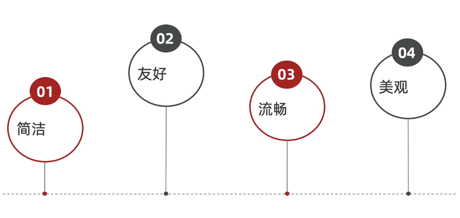
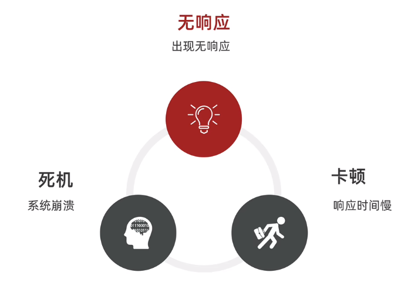
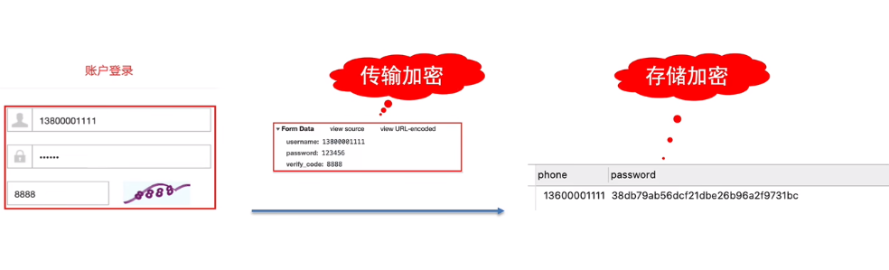
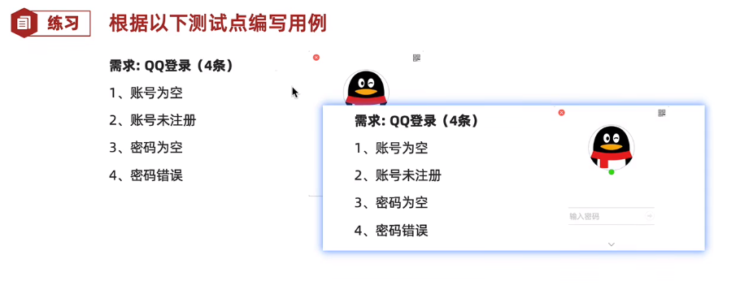
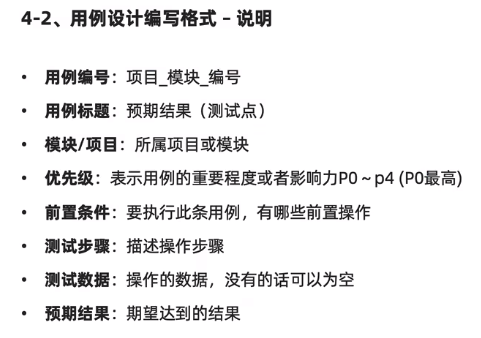

# 03软件及测试

## 1.什么是软件

软件:控制计算机硬件的工作工具

## 2.软件开发流程

软件测试工作内容：将开发出的产品与需求文档做对比

## 3.什么是 软件测试

软件测试：使用**技术**手段**验证**软件是否满足使用需求

## 4.软件测试的目的

软测目的:简单来说就是  减少软件或程序中存在的BUG

​				 官方的话语表达就是  减少软件缺陷(BUG) 保证软件质量

列如：1.需求不合理

​			2.产品经理提出需求不合理

​			3.UI设计师设计页面不美观

​			4.开发出现逻辑漏洞等

# 05主流技术

## 1.功能测试

功能测试主要**验证**程序的**功能**是否满足需求

## 2.自动化测试

使用**代码**或**工具**代替手工，对项目进行测试

## 3.接口测试

使用**代码**或**工具**对服务端提供的接口进行测试  

## 4.性能测试

模拟**多人**使用软件，查找**服务器缺陷**

# 06测试分类

## 1.按测试阶段划分

### 	①单元测试

​				针对程序源代码进行测试

### 	②集成测试

​				又称为接口测试，针对模块之间访问地址进行测试

### 	③系统测试

​				对整个系统进行测试包括功能兼容、文档等测试

### 	④验收测试

​				特殊项目，列如一些内测

## 2.按代码可见度划分

### 	①黑盒测试 

​				源代码不可见，UI可见

### 	②灰盒测试

​				部分源代码可以，功能不可见

### 	③白盒测试

​				全部代码可见，UI功能可见

# 07质量模型

说明：衡量一个优秀软件的维度

从以上8个方面衡量

- 功能测试

  

- 性能测试

- 兼容性

- 易用性

  

- 可靠性

  

- 安全性

  

- 可移植性

  通俗来说就是容易搬家

- 可维护性

  简单来说就是容易维护，后期拓展功能或修改容易

# 08测试流程

## 1.需求评审

各部们需求理解一致

测试主要了解：需要知道需求里有多少功能 哪些功能是核心功能

## 1.计划编写

测什么、谁来测、怎么测

## 2.用例设计

验证项目是否符合需求的操作文档

## 3.用例执行

根据操作文档实施测试

## 4.缺陷管理

从缺陷描述到提交给开发等待开发修复完成再去验证缺陷是否修复最后关闭的过程就称为缺陷管理

## 5.测试报告

实施测试结果的文档称为测试报告

# 09测试用例

## 1.什么是用例

​	用例：用户使用的案例

## 2.什么是测试用例

​	测试用例：为测试项目而设计的执行文档

## 3.测试用例的作用

- ​	防止漏测

- ​	实施测试的标准

## 4.1用例设计编写格式

### 	①用例编号

​			用例编号：项目简称_模块简称__编号

### 	②用例标题 

​			用例标题：期望结果（测试点）

### 	③项目/模块

​			项目/模块：所属项目或模块

### 	④ 优先级

​			优先级：表示用例的重要程度或影响力P0-P4（P0最	高） 注意：用户用的频率最高的为P0

### 	⑤前置条件

​				要执行此条用例，有哪些前置操作

​				列如：我需要验证登录 需要先输入账号密码

### 	⑥ 测试步骤

​			测试步骤：描述操作步骤

### 	⑦测试数据

​			测试数据：操作中所需要的数据，没有的话可以为空

### 	⑧ 预期结果

​			预期结果：期望达到的结果

# 09用例的练习

